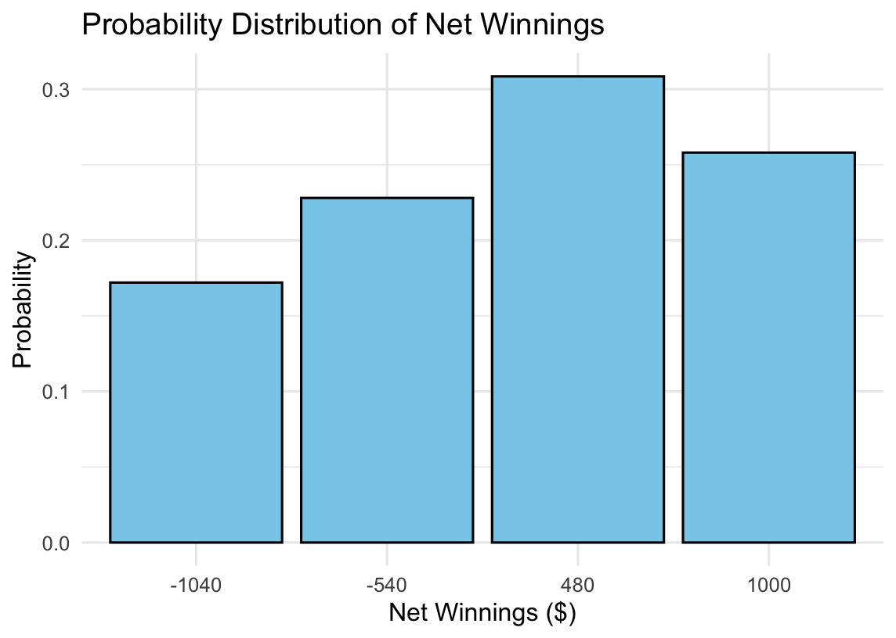
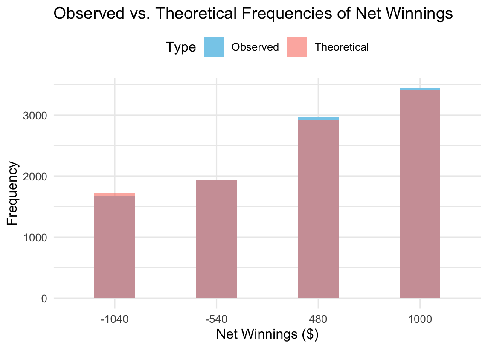
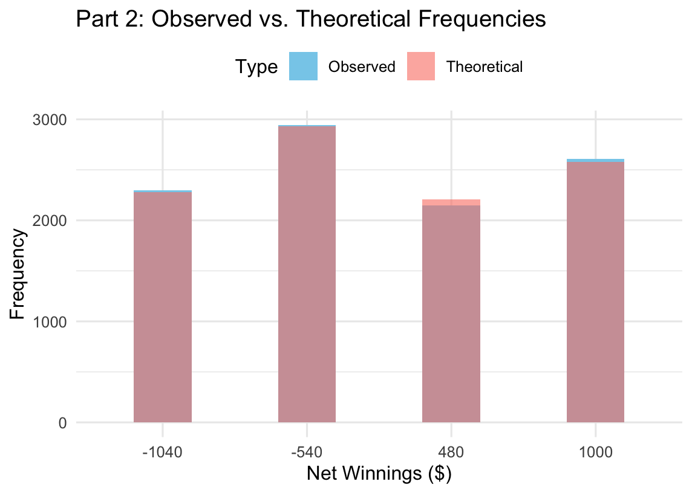
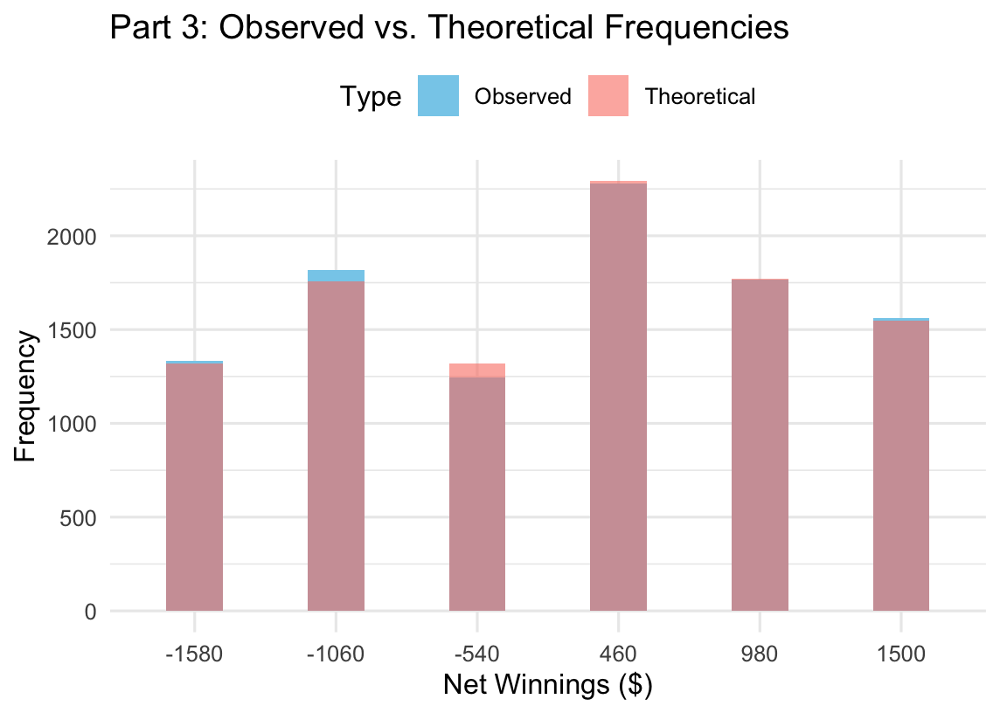

# 🎲 Sports Betting Strategy Analysis

A simulation-based project analyzing the optimal strategy for betting on the better team in sports series (best-of-3, best-of-5, best-of-7). This study combines probability theory, expected value modeling, Monte Carlo simulation, and chi-square testing to determine when betting on the favorite is most profitable.

[📥 Download Full Report (PDF)](report/Sports_Betting_Strategy_Simulation_Using_R.pdf)

---

## 📌 Project Highlights

- **Scenario**: Baseball-style tournaments with a better team (e.g., 60% win probability)
- **Goal**: Evaluate whether always betting on the better team yields long-term gain
- **Approach**: Compare different series formats using both theory and simulation
- **Result**: Longer series (e.g., best-of-7) significantly reduce betting risk and increase ROI

---

## 🧠 Methodology Overview

### 📊 Theoretical Modeling
- Used binomial probability to calculate win likelihoods for 3/5/7 game series
- Derived expected return and variance from win/loss outcomes

### 🔁 Monte Carlo Simulation
- Simulated 10,000 tournaments under various assumptions
- Measured actual vs. expected performance of the better team

### 🧪 Statistical Validation
- Applied chi-square test to validate simulation consistency with theory

---

## 📷 Key Visuals

### 🧮 Expected Value by Series Length  

### 📉 Standard Deviation (Risk) vs. Series Type  

### 🧪 Chi-Square Distribution of Simulated Outcomes  

### 🎯 Betting Recommendation by Series Type  

---

## 🧾 Code Availability

All modeling and simulation were performed in R.  
R code is located in the `/code/` folder and includes:
- Probability calculations
- Expected value functions
- Monte Carlo simulation logic
- Chi-square tests

---

## 🧰 Tools & Technologies

- **Statistical Modeling**: Binomial distributions, EV & variance
- **Simulation**: Monte Carlo (R)
- **Validation**: Chi-Square test
- **Tools**: R, RMarkdown, Excel

---

## 📁 Project Structure

- `/assets/` – Visualization figures  
- `/code/` – R source code and simulation functions  
- `/report/` – Final PDF report with findings and recommendations  
- `README.md` – You are here

---

## 🙋‍♂️ About Me

I'm a graduate student in Data Analytics at Northeastern University with experience in statistical modeling, simulation, and data storytelling. My portfolio combines technical depth with business applications across Tableau, R, Python, and SQL.

📬 Contact:  
📧 allen.lei.zhao@gmail.com  
🔗 [LinkedIn](https://www.linkedin.com/in/allen-lei-zhao/)  
🌐 [Portfolio](https://allenleizhao.github.io)

---

© 2025 Lei Zhao — All rights reserved.
